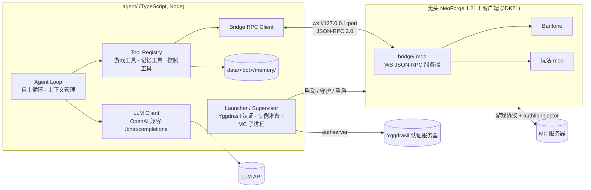
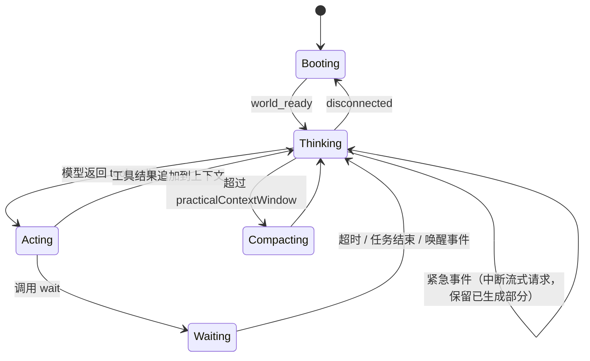

# SmartWhale 设计文档

> 一个基于**无头 Minecraft 客户端**、由 **LLM 自主驱动**的 Minecraft 机器人。
> 目标平台：Minecraft 1.21.1 + NeoForge（21.1.x），支持 mod。

## 1. 目标与非目标

### 目标

- **真客户端**：运行真实的 NeoForge 客户端（去掉渲染），因此能加入装有任意 mod 的服务器，并且 mod 的客户端逻辑、注册表同步、自定义网络包都正常工作。
- **完全自主**：机器人自己决定玩什么、怎么玩，不依赖外部给定的目标。
- **社交**：通过游戏内聊天与其他玩家交流。其他玩家的话属于社交输入，不是指令，机器人可以回应、合作，也可以忽略。
- **自管记忆**：由模型通过工具读写自己的记忆文件，并自己决定加载哪些内容。
- **认证**：支持 authlib-injector 外置登录服务器。

### 非目标（当前阶段）

- 多 bot 协调。一个 Node 进程只对应一个 bot，想多开就由用户自己启动多个 node 进程。
- 代码生成和技能库（Voyager 风格）。只采用纯工具调用。
- 视觉输入（截图）。
- 正版（微软）认证、离线认证。架构上不排斥，以后再做。

## 2. 总体架构



两个进程各自负责：

| 组件 | 语言 | 职责 |
|---|---|---|
| `bridge/` | Java 21, NeoForge mod | 感知世界、执行动作、封装 Baritone、查询注册表和配方、推送事件。**不含任何 LLM 逻辑。** |
| `agent/` | TypeScript, Node ≥ 22 | 启动和守护 MC、认证、Agent 循环、LLM 调用、工具定义、记忆、上下文管理、日志。 |

这样拆分的理由：迭代 agent 时不用重启 MC；任一进程崩溃都不会连带另一个；LLM 生态主要在 JS/TS 这边。

## 3. 目录结构

```text
SmartWhale/
├─ docs/
│  └─ DESIGN.md
├─ bridge/                       # NeoForge mod (ModDevGradle)
│  ├─ build.gradle
│  ├─ settings.gradle
│  ├─ gradle.properties
│  └─ src/main/
│     ├─ java/dev/smartwhale/bridge/
│     │  ├─ SmartWhaleBridge.java        # @Mod 入口
│     │  ├─ server/                      # WebSocket 服务端（自带 RFC 6455 实现）、鉴权、JSON-RPC 分发
│     │  ├─ rpc/                         # 方法注册表、参数/结果 DTO、错误码
│     │  ├─ observe/                     # 状态、背包、方块、实体、界面
│     │  ├─ knowledge/                   # 注册表、配方、物品信息
│     │  ├─ action/                      # 瞬时动作（看、交互、攻击、放置、聊天…）
│     │  ├─ menu/                        # 通用容器 / mod GUI 操作、合成
│     │  ├─ task/                        # 长任务管理（TaskManager、超时、卡住检测）
│     │  ├─ event/                       # 游戏事件 → JSON-RPC 通知、自动连接
│     │  ├─ mixin/                       # 隐藏窗口、跳过渲染、输入接管、拾取钩子
│     │  ├─ util/                        # 参数解析、方块/物品匹配、tick 回调
│     │  └─ compat/                      # 可选 mod 集成（按 ModList 条件加载）
│     │     ├─ baritone/                 # 设置、task.* 实现（含 task.mine 循环）
│     │     ├─ jei/                      # @JeiPlugin、RecipeSource、配方转移
│     │     └─ tacz/                     # 枪械操作与状态
│     └─ resources/META-INF/neoforge.mods.toml
├─ agent/                        # Node / TypeScript
│  ├─ package.json
│  ├─ tsconfig.json
│  ├─ scripts/                           # 通过调试端点驱动 bot 的脚本（m1-demo.ts）
│  └─ src/
│     ├─ main.ts                         # CLI 入口：smartwhale run <config>
│     ├─ config/                         # 配置 schema (zod) 与加载
│     ├─ launcher/                       # 实例准备、Yggdrasil、直接启动 MC 子进程
│     ├─ bridge/                         # WS JSON-RPC 客户端、事件流、调试端点（control.ts）
│     ├─ llm/                            # OpenAI 兼容客户端、重试、计费
│     ├─ tools/                          # 工具定义（zod schema → JSON Schema）
│     │  ├─ game/                        # 映射到 bridge 方法
│     │  ├─ memory/                      # 文件系统记忆工具
│     │  └─ control/                     # wait 等控制工具
│     ├─ agent/                          # 主循环、提示词、上下文压缩、事件调度
│     └─ util/
├─ config/
│  └─ bot.example.json                   # 配置示例（真实配置不入库）
├─ libs/                                 # 第三方 mod jar，如 Baritone（gitignore）
├─ run/<bot>/                            # bot 游戏目录（gitignore）
└─ data/<bot>/                           # bot 数据（gitignore）
   ├─ memory/                            # 模型自管记忆
   ├─ auth.json                          # 缓存的 Yggdrasil token
   └─ logs/                              # 对话转录 JSONL、bridge 日志
```

## 4. 运行时与启动

### 4.1 游戏实例

- **共享**：`D:\.minecraft` 下的 `libraries/`、`assets/`、`versions/1.21.1-NeoForge/`（NeoForge 21.1.252）。
- **独立游戏目录**：`run/<bot>/`。由 launcher 在每次启动前完成同步：
  - `mods/`：按配置从源实例（`D:\.minecraft\versions\1.21.1-NeoForge\mods`）复制，再加上 `smartwhale-bridge` 和 Baritone。
  - `options.txt`：写入适合 bot 的值，例如 `renderDistance=8`、`pauseOnLostFocus=false`、音量全部为 0、`onboardAccessibility=false`、`skipMultiplayerWarning=true`。
  - `config/`：按需从源实例复制 mod 配置。
- **Mod 分类**（按源实例当前列表初步划分）：

  | 处理方式 | Mod |
  |---|---|
  | 去掉（渲染） | sodium, iris |
  | 去掉（纯客户端 UI） | BetterF3, mobhealthbar, appleskin |
  | 保留（bot 功能依赖） | jei 及其依赖 mezz_config(_gui)，用于读取配方和配方转移，见 §6.3 knowledge.* |
  | 保留（玩法 / 需与服务端一致） | FarmersDelight, sophisticatedbackpacks/core, curios, caelus, elytraslot, Gobber, guardvillagers(+tacz support), tacz, ysm, solcarrot, attributefix 以及它们的依赖库（architectury, bookshelf, cloth-config, geckolib, prickle） |

  YSM 和 TACZ 已经在更小规模的项目里实测过，无头模式下可以工作。

  配置里用 `mods.include` / `mods.exclude` 的 glob 来表达，不硬编码。

### 4.2 无头化

客户端保留**真实的 GL 上下文**，只是不显示窗口、不渲染：

- `agent/launcher/game.ts` 读取启动器安装好的合并版 version json（不支持 `inheritsFrom`），自己拼 classpath、JVM 参数和游戏参数，直接启动 `java`，不借助第三方启动器。
  - 规则匹配兼容 HMCL 的非标准写法 `os.name: "universal"`（表示任意 OS）。
  - natives 目录优先使用实例里 HMCL 已解压的 `natives-windows-x86_64`。
- bridge 的 mixin 负责隐藏窗口，只在 `-Dsmartwhale.bridge.headless=true` 时生效，所以 attach 模式下的正常客户端不受影响：
  - `WindowMixin`：创建窗口时设置 `GLFW_VISIBLE=false`，并在 `updateDisplay` 后保持隐藏。
  - `GameRendererMixin`：加载 overlay 结束后取消 `GameRenderer.render`。
  - `LevelLoadStatusManagerMixin`：进服、重生、换维度后的加载界面原本要等玩家所在区块**编译完渲染数据**才关闭；不渲染时这永远不会发生，只能等 30 秒超时。改为区块数据到达即视为就绪。
- 隐藏窗口从不抓取鼠标，带来两个输入问题，由 `MinecraftMixin` 和 `action/InputControl` 处理：
  - 原版每 tick 调用 `continueAttack(screen == null && keyAttack.isDown() && mouseGrabbed)`，在这里等价于 `continueAttack(false)`，会立刻中止挖掘。bridge 挖掘期间屏蔽这次调用，并在自己的 `ClientTickEvent.Pre` 里推进挖掘（这样有界面打开时也能继续）。
  - 持续右键（吃东西、拉弓）用真实的 `keyUse.setDown(true)`，同时屏蔽原版 `startUseItem` 的重复触发。
  - 另外因为不渲染，`mc.hitResult` 不会更新，bridge 的所有瞄准和可见性判断都用自己的射线检测。
- launcher 往游戏目录的 `config/fml.toml` 写入 `earlyWindowControl = false`，否则 FML 的早期加载窗口会在 mod 加载之前弹出来。
- 启动时附加的 JVM 参数：
  - `-javaagent:<authlib-injector.jar>=<yggdrasil API URL>`、`-Dauthlibinjector.side=client`
  - `-Dsmartwhale.bridge.port=<port>`、`-Dsmartwhale.bridge.token=<随机 secret>`、`-Dsmartwhale.bridge.headless=true`
  - `-Dsmartwhale.bridge.perception=visible|omniscient`：感知模式（§6.3），由 bridge 统一执行，agent 无法绕过
  - `-Dsmartwhale.bridge.autoconnect=<host:port>`：bridge 在标题界面或断线界面自动连接服务器，失败按指数退避重试，并通过 `event.disconnect_screen` 上报断线原因。
  - `-Dstdout.encoding=UTF-8` 等：launcher 按 UTF-8 解码子进程输出。
- launcher 接管子进程的 stdout/stderr 并写入 `data/<bot>/logs/minecraft.log`，token 会被打码。

> **为什么不用 HeadlessMC**（M0 结论）：HeadlessMC 的 `-lwjgl` 会把 LWJGL 换成空实现，完全没有 GL 上下文。YSM 的 native 库（`ysm-core.dll`）在加载阶段依赖 GL，在这种环境下会报 `RuntimeException: err: 35`。而服务端要求客户端必须装 YSM，否则在注册表同步阶段就会被拒。换成真实 LWJGL 加隐藏窗口后问题消失。代价是每个 bot 占一个隐藏的 GL 上下文，不渲染时开销很小。

### 4.3 认证（authlib-injector）

由 `agent/launcher/yggdrasil.ts` 实现：

1. 读取 `data/<bot>/auth.json`。如果有缓存 token，先调用 `POST {api}/authserver/validate` 检查，失效则调用 `/refresh`。
2. 没有缓存或刷新失败时，调用 `POST {api}/authserver/authenticate`：`{ username, password, clientToken, agent: { name: "Minecraft", version: 1 } }`，拿到 `accessToken` 和 `selectedProfile { id, name }`。
3. 密码优先从环境变量读取（`SMARTWHALE_AUTH_PASSWORD`），其次读取 `passwordFile` 指向的文件（该文件已被 git 忽略，只包含密码）；密码不写入配置文件和日志。
4. 预取 API 元数据，通过 `-Dauthlibinjector.yggdrasil.prefetched=<base64>` 传入，免去 agent 启动时的一次网络请求。
5. 游戏参数：`--username <name> --uuid <id> --accessToken <token> --userType msa --clientId 0 --xuid 0`。

## 5. Bridge mod 设计

### 5.1 技术选择

- 构建：ModDevGradle，NeoForge 21.1.252，Parchment mappings，Java 21。
- WebSocket：MC 自带的 Netty 不包含 `netty-codec-http`，所以 bridge 内置一个最小的 RFC 6455 实现（阻塞 socket 加线程池），只监听 `127.0.0.1`。不引入额外依赖，也不需要 jar-in-jar。
- 开发时可以用 `bridge/quickbuild.mjs` 直接拿实例里的 jar 跑 javac，几秒出包；Gradle 构建（ModDevGradle）用于正式产物。
- JSON：使用 MC 自带的 Gson。
- Baritone：**软依赖**。`libs/baritone-api-neoforge-1.11.2.jar`（不入库）同时作为 `compileOnly` 依赖和运行时 mod，由 launcher 通过 `minecraft.mods.extra` 只放进 bot 的 `mods/`，玩家自己的实例不受影响。bridge 用 `ModList.isLoaded("baritoe")`（Baritone 的 mod id 就是这么拼的）判断；未安装时 `compat/baritone/` 下的类不会被加载，`task.*` 移动类方法返回"Baritone 未安装"的错误。
- 只在客户端加载（`neoforge.mods.toml` 中 `side = "CLIENT"`）。

### 5.2 线程模型

- 连接线程负责接收请求、解析 JSON-RPC。
- **所有涉及游戏状态的读写**都通过 `Minecraft.getInstance().submit(...)` 投递到客户端主线程执行，再把结果带回 IO 线程写出。
- 长任务（寻路、挖矿等）由 `TaskManager` 在客户端 tick 事件里推进，结束时发出通知。
- 每个请求有超时（默认 10s），超时返回错误，不阻塞主线程。

### 5.3 安全

- 只监听 `127.0.0.1`。
- 连接后必须先调用 `bridge.hello` 并带上 token，否则断开。
- 同一时刻只允许一个 agent 连接；新连接会踢掉旧连接，以便 agent 重启后重连。
- 端口和 token 优先读取系统属性 `smartwhale.bridge.port` / `smartwhale.bridge.token`。如果都没有设置，则读取 `<gameDir>/config/smartwhale-bridge.toml`，用于 attach 模式，见 §7.8。

### 5.4 Baritone 配置

由 bridge 在进入世界时写入（`compat/baritone/Bari.java`）：

- `chatControl=false`、`prefixControl=false`、`echoCommands=false`、`chatDebug=false`，防止聊天内容触发 Baritone 命令，也不让它往聊天栏输出。
- `allowBreak=true`、`allowPlace=true`、`allowSprint=true`、`allowInventory=true`、`autoTool=true`、`allowParkour=false`。
- `freeLook=false`、`antiCheatCompatibility=true`，尽量模拟正常玩家。
- 关闭所有渲染和桌面通知（`renderPath`、`renderGoal`、`renderSelectionBoxes`、`desktopNotifications`）。
- `logger` 替换为 bridge 自己的回调：Baritone 的日志进入 bridge 日志，"寻路失败"类消息被计数，用于任务失败判定和 hint。
- `acceptableThrowawayItems` 暂用默认值。

## 6. 通信协议（WebSocket + JSON-RPC 2.0）

### 6.1 约定

- 地址：`ws://127.0.0.1:<port>/rpc`，一帧对应一个 JSON-RPC 消息，不使用批量请求。
- 方法名采用 `namespace.verb` 形式，参数和结果都是对象，字段用 `snake_case`。
- 坐标：方块坐标为 `{ "x": int, "y": int, "z": int }`，实体位置为 double。
- 物品和方块用注册表 id 表示（如 `minecraft:oak_log`、`farmersdelight:cabbage`）。需要多个时可以用 tag（`#minecraft:logs`）。
- 时间以 tick 为单位，另外附带人类可读的字段。

### 6.2 错误码

| code | 含义 |
|---|---|
| -32600 ~ -32603 | JSON-RPC 标准错误 |
| 1001 | `NOT_IN_WORLD`：未进入世界 |
| 1002 | `TIMEOUT` |
| 1003 | `INVALID_TARGET`：方块、实体或槽位不存在，或超出距离 |
| 1004 | `NO_RECIPE` / `MISSING_INGREDIENTS` |
| 1005 | `NO_MENU`：当前没有打开对应界面 |
| 1006 | `TASK_BUSY`：已有互斥任务在运行 |
| 1007 | `UNAUTHORIZED` |

`error.data` 里带 `hint` 字段，给 LLM 一条可执行的建议，例如 `"需要工作台，附近 32 格内未找到"`。

### 6.3 方法清单

#### bridge.*

| 方法 | 说明 |
|---|---|
| `bridge.hello { token, protocol }` | 鉴权和协议版本协商，返回 bridge 版本、MC/NeoForge 版本、已加载 mod 列表、能力列表 |
| `bridge.ping` | 心跳 |

#### observe.*（只读）

| 方法 | 说明 |
|---|---|
| `observe.status` | 名字、维度、坐标、朝向、生命/最大生命、饥饿/饱和、经验、护甲、状态效果、主手/副手物品、是否着火/在水中/在地面、是否没入水中和剩余氧气（`underwater`、`air`、`max_air`，M2）、群系、光照、游戏时间（含昼夜）、天气、当前任务 |
| `observe.inventory` | 快捷栏（标出选中槽位）、主背包、护甲栏、副手、手上拿着的物品、各物品总数、空槽数。槽位编号沿用 `Inventory`：0–8 快捷栏、9–35 主背包、36–39 护甲（脚→头）、40 副手。Curios 槽位暂未列出 |
| `observe.blocks { radius≤16, blocks?, mode }` | 周围方块概览：`mode=summary` 返回各类方块的计数和最近坐标，`mode=list` 返回坐标列表（有上限） |
| `observe.find_blocks { blocks, radius≤64, limit≤64 }` | 查找最近的指定方块（`blocks` 是 id 或 `#tag` 列表）。受**感知模式**约束（见下文） |
| `observe.block { pos }` | 方块 id、blockstate 属性、硬度、是否需要工具、是否有方块实体、是否可见、是否在触及距离内。`visible` 模式下看不见的方块拒绝查询 |
| `observe.entities { radius, filter? }` | 附近实体：类型、名字、距离、坐标、生命值，以及是否敌对、是否玩家。`filter` 可选 `hostile`、`player`、`item`、`living` 或实体类型 id |
| `observe.players` | 在线玩家列表（tab 列表），并标出附近的玩家 |
| `observe.screen` | 当前打开的界面：menu 类型 id、标题、槽位（index、物品、数量、属于容器还是玩家背包）、可点击控件（index、文字、类型）、进度条类数据（ContainerData） |

**感知模式**（配置项 `bridge.perception`，默认 `visible`，通过系统属性传给 bridge，见 §4.2）：

- `visible`：`observe.blocks` 和 `observe.find_blocks` 只返回至少有一面不是实心不透明方块的方块，同时还要求在 4 格内，或者从 bot 眼睛到方块中心或某个外露面中心的射线无遮挡。效果接近真人，矿石要靠自己去找、去挖。
- `omniscient`：返回客户端已加载区块中的所有匹配方块，相当于矿透。
- 搜索从近到远逐层扩大半径，可见性判断按距离顺序惰性执行，找够 `limit` 个就停。
- `task.mine` 和 `task.goto_block` 选目标也走同一套感知逻辑，不使用 Baritone 的方块搜索。Baritone 的 `legitMine` 不合适：它在没有已知目标时会去 y=11 挖矿道，而且只认识触及距离内的方块。

#### knowledge.*（只读，客户端本地）

配方数据有两个来源，统一由 `knowledge/RecipeSource` 抽象：

1. **JEI（首选，`compat/jei/`）**：通过 `@JeiPlugin` 的 `onRuntimeAvailable` 拿到 `IJeiRuntime`。它的优势是：
   - 覆盖所有向 JEI 注册了配方类别的 mod，包括不走原版 `RecipeManager` 的配方，以及 JEI 中的"虚拟"配方，比如 Farmer's Delight 的砧板/厨锅、各种机器配方、交易、堆肥。
   - 有 **catalyst**，即每类配方用什么方块或机器完成，这正是 LLM 规划时最需要的信息。
   - 提供 `jei:information` 信息页（mod 作者写的物品获取说明），以及 fluid 等非物品原料。
   - 提供配方转移（见 `menu.jei_transfer`）。

   查询时使用 `IRecipeManager.createRecipeLookup(type).limitFocus(focus)` 和 `getRecipeIngredients(category, recipe)`，后者按 `INPUT / OUTPUT / CATALYST` 区分原料，不需要构建 GUI 布局。只有执行转移时才调用 `createRecipeLayoutDrawable` 拿 `IRecipeSlotsView`。
2. **原版 `RecipeManager`（兜底）**：JEI 未加载或未就绪时使用。1.21.1 中服务端会把全部配方同步到客户端。

**配方引用**：所有返回的配方都带 `recipe_ref`，格式为 `"<category_uid>|<recipe_id 或稳定哈希>"`。有 `RecipeHolder` 的配方使用它的 id；JEI 的虚拟配方使用"类别 + 输入输出"计算出的哈希。bridge 维护会话级缓存，用于把 `recipe_ref` 映射回配方对象，供后续 `knowledge.recipe` 和 `menu.jei_transfer` 使用。

**原料表示**：每个原料槽位是一组候选项（用 tag 表示时给出 tag 名和前几个候选物品），附带数量、类型（item / fluid / 其他）以及 `slot_name`（如果有）。结果会标出背包里已经有多少。

| 方法 | 说明 |
|---|---|
| `knowledge.search { query, kind: item\|block\|entity\|fluid, limit }` | 按 id、本地化名、mod 名模糊搜索。JEI 可用时使用 `IIngredientFilter`，支持 `@mod`、`#tag` 语法 |
| `knowledge.item { id }` | 物品信息：名字、tooltip、最大堆叠、耐久、食物属性、所属 tag，以及 JEI 信息页文本（如果有） |
| `knowledge.categories { mod? }` | 列出配方类别：uid、显示名、所属 mod、catalyst（即对应的工作站或机器） |
| `knowledge.recipes { item, role: output\|input\|catalyst, category?, limit, offset }` | `output` 表示怎么做出这个物品，`input` 表示这个物品能用来做什么，`catalyst` 表示这台机器能做什么。结果按类别分组，每条包含 `recipe_ref`、输入、输出（含概率产出）、catalyst，以及类别能提供的额外信息（耗时、经验、能量等，从配方对象尽量提取） |
| `knowledge.recipe { recipe_ref }` | 单条配方的完整信息，并给出"能否用 `menu.jei_transfer` 转移到当前界面"的判断 |
| `knowledge.plan { item, count, max_depth? }` | **合成规划**：结合当前背包，递归展开配方树。优先选择原版合成、熔炼，以及已有 catalyst 的类别；可以用 `prefer_categories` 指定偏好。返回按依赖排好顺序的步骤（每步写明 recipe_ref、所需工作站、次数），以及还缺哪些"原材料"（找不到配方，或只能靠采集获得的物品）。遇到循环配方（如锭和块互转）会剪枝 |

#### action.*（瞬时动作，同步返回结果）

| 方法 | 说明 |
|---|---|
| `action.chat { message }` | 发送聊天，最长 256 字符。`/` 开头的命令只允许白名单内的（`/msg`、`/tell`、`/w`、`/r`、`/me`） |
| `action.look { pos \| entity_id \| yaw,pitch }` | 转向 |
| `action.select_hotbar { slot }` | 选择快捷栏槽位 |
| `action.equip { item, slot: mainhand\|offhand\|head\|... }` | 把背包中的物品装备到指定位置 |
| `action.drop { item?, slot?, count }` | 丢弃物品 |
| `action.use_item { hand, duration_ticks? }` | 右键使用物品（吃东西、拉弓、使用 mod 物品），支持持续按住；按住期间异步等待，结束后返回 |
| `action.interact_block { pos, face? }` | 右键方块（开门、开箱、操作 mod 机器）；需要时自动转向，超出触及距离时报错 |
| `action.break_block { pos, auto_tool? }` | 挖掉单个可触及且可见的方块，挖完才返回。超时按预计挖掘时间的两倍计算，最长 60 秒。`auto_tool`（默认开）的选择规则见下文 |
| `action.place_block { item, pos, against? }` | 在指定位置放置方块；`against` 指定贴着哪个相邻方块放，默认自动选 |
| `action.interact_entity { entity_id }` | 右键实体（交易、骑乘、喂养） |
| `action.attack { entity_id }` | 攻击一次，会考虑攻击冷却 |
| `action.eat { item?, prefer? }` | **M2**。吃东西：不指定 `item` 时从背包自动选食物（`prefer` 是优先的物品 id 列表，其次按饱和度选，避开有负面效果的食物），装到手上吃完再换回原来的手持物品。饥饿值已满且食物不能随时吃时报错 |
| `action.respawn` | 死亡后重生 |

**自动选工具**：只有"比空手挖得快"或"该方块必须用它才有掉落"的物品才算合适的工具，挖掉落要求高于挖掘速度。没有合适工具时**切换为空手**：先找快捷栏空槽，快捷栏满了就把手上的物品换到主背包的空槽。这样不会拿着枪、食物或剑去挖方块（TACZ 的枪本身就挖不动方块）。

#### menu.*（通用界面操作，可覆盖 mod GUI）

| 方法 | 说明 |
|---|---|
| `menu.click { slot, button, click_type }` | 底层槽位点击（PICKUP / QUICK_MOVE / SWAP / THROW / PICKUP_ALL） |
| `menu.transfer { item, count, to: container\|player }` | 高层操作：在容器和背包之间搬运物品 |
| `menu.click_widget { index }` | 点击界面上的按钮控件（用于 mod GUI），控件来自 `observe.screen` |
| `menu.craft { item \| recipe_ref, count }` | 合成：自动找配方。2x2 用背包合成格，3x3 需要已打开工作台。优先使用 JEI 转移，否则用原版 `handlePlaceRecipe` 摆好原料，然后 shift 点击取出。会循环执行直到达到 count 或原料耗尽 |
| `menu.jei_transfer { recipe_ref, max?: bool }` | 对**当前打开的界面**执行 JEI 配方转移，相当于点击 JEI 的"+"按钮。适用于所有为 JEI 注册了 `IRecipeTransferHandler` 的 mod 机器和工作台。会先调用 `transferRecipe(..., doTransfer=false)` 检查，失败时返回 JEI 给出的错误（例如缺少原料、界面不匹配），作为 hint。转移后如何取出产物（产物槽、等待加工）由模型通过 `observe.screen` 和 `menu.click` 或 `menu.transfer` 完成 |
| `menu.close` | 关闭当前界面（M1 已实现；其余 menu.* 在 M3） |

#### task.*（长任务，异步完成）

`task.*` 的启动方法立即返回 `{ task_id }`。任务完成时推送 `event.task_finished` 或 `event.task_failed`。同一时刻只运行一个任务，启动新任务会取消旧任务（旧任务以 `reason=superseded` 失败）。启动时就能判断的问题（参数错误、附近没有目标）直接作为 RPC 错误返回，不创建任务。

| 方法 | 实现 | 说明 |
|---|---|---|
| `task.goto { pos, range? \| xz \| y }` | `CustomGoalProcess` + `GoalNear`/`GoalBlock`/`GoalXZ`/`GoalYLevel` | 前往目标位置 |
| `task.goto_block { blocks }` | `GoalComposite`（最近 8 个可感知方块的 `GoalGetToBlock`） | 走到最近的某类方块旁 |
| `task.mine { blocks, count, radius? }` | **自己的循环**，Baritone 只负责走路 | 挖掉 `count` 个方块（不是"背包里凑够 count 个"），默认半径 32。循环：选最近的可感知目标 → 走到可触及且可见处 → 挖 → 捡掉落物。到不了或挖不动的目标会被跳过，原因记在结果的 `skipped` 里。掉落要求特定工具而背包里没有时，以 `reason=no_tool` 失败 |
| `task.follow { entity_id \| player, duration_s? }` | `FollowProcess` | 跟随，默认 300 秒后结束 |
| `task.explore { origin?, duration_s? }` | `ExploreProcess` | 向未探索区块移动，默认 60 秒 |
| `task.farm { range, duration_s? }` | `FarmProcess` | 收获并重新种植作物，默认 120 秒 |
| `task.collect_items { radius? }` | 自定义 | 捡起附近（默认 8 格）掉落物；附近没有掉落物时直接报错 |
| `task.fight { targets, roe? }` | **M2**。自己的循环，Baritone 负责追击 | 按交战规则（RoE，见下文）持续近战：选目标 → 追到触及距离 → 等冷却攻击 → 下一个。自动换上最好的近战武器。结束字段：`kills`、`hits`、`damage_taken`、`stopped_by` |
| `task.flee { from?, distance? }` | **M2**。Baritone `GoalRunAway` | 远离威胁（默认：附近所有敌对生物；也可指定实体 id 或类型），直到与它们的距离都超过 `distance`（默认 24） |
| `task.surface` | **M2**。自定义 | 在水中时游向最近的空气或陆地（优先陆地），到达后结束；不在水中时直接报错 |
| `task.status` | — | 当前任务和进度 |
| `task.cancel` | `cancelEverything` | 取消当前任务 |

所有移动类任务都需要 Baritone（§5.1）。

任务有超时（`timeout_s`，默认 5 分钟）。另外有"卡住检测"：30 秒内位置没有变化且任务没有报告进展时，判定失败，`reason=stuck`。断线或死亡也会让任务失败。

结束事件统一带：`task_id`、`kind`、`elapsed_s`、`pos`、`inventory_delta`（任务期间背包变化），失败时还有 `reason` 和 `hint`，以及各任务自己的字段（如 `mined`、`requested`、`skipped`）。

**`task.fight` 的交战规则（RoE）**：由模型在每次调用时给出，只对这一次调用有效，省略的字段用 bridge 默认值。没有常驻 RoE，也没有空闲时的自动反击（不设反射层，§10 R7）。字段固定，不使用表达式语言：

```json
{
  "targets": ["minecraft:zombie", "#hostile", "player:Steve", 12345],
  "roe": {
    "radius": 16,
    "leash": { "center": "start", "max_distance": 24 },
    "retaliate": true,
    "never_attack": ["minecraft:creeper", "#players", "minecraft:villager"],
    "weapon": "auto",
    "stop_if": {
      "health_below": 8,
      "targets_more_than": 3,
      "seen": ["minecraft:creeper"],
      "duration_s": 60,
      "no_target_for_s": 5
    },
    "on_stop": "stand"
  }
}
```

| 字段 | 含义 | 默认 |
|---|---|---|
| `targets` | 攻击谁：实体 id、实体类型 id、tag（`#hostile` 表示所有敌对生物、`#players`）、`player:<名字>` | 必填 |
| `radius` | 以 bot 为中心搜索目标的范围 | 16 |
| `leash` | 追击不超过离 `center`（`"start"` 或坐标）多远 | start, 24 |
| `retaliate` | 不在 `targets` 里、但攻击了 bot 的实体也算目标（仍受 `never_attack` 约束） | true |
| `never_attack` | 绝不攻击的实体，优先级最高 | `["#players"]`，除非 `targets` 明确点名了某个玩家 |
| `weapon` | `auto`（选伤害最高的近战武器，不用枪）或物品 id | auto |
| `stop_if.health_below` | 生命低于该值时停止 | 6 |
| `stop_if.targets_more_than` | 范围内目标数超过该值时停止 | 不限 |
| `stop_if.seen` | 范围内出现这些实体时停止（如苦力怕） | 无 |
| `stop_if.duration_s` | 最长交战时间 | 60 |
| `stop_if.no_target_for_s` | 连续多久没有目标就算打完 | 5 |
| `on_stop` | 因 `stop_if` 停止后做什么：`stand`、`flee`（转为 `task.flee`）、`{ "retreat_to": pos }` | stand |

因 `stop_if` 停止时任务以 `reason=roe:<规则名>`（如 `roe:health_below`）失败；目标全部消灭或 `no_target_for_s` 到期则正常结束。

#### tacz.*（可选模块，仅在 `tacz` 已加载时注册）

TACZ 的枪械既不走原版 `attack`，也不走 `use_item`，而是由客户端直接调用 `IClientPlayerGunOperator`，再由 TACZ 自己发网络包。所以需要专门的工具。

- **实现**：放在 bridge 的 `compat/tacz/` 包中，以 `compileOnly` 依赖 TACZ jar。只有 `ModList.isLoaded("tacz")` 为真时才加载这个包里的类并注册方法，未安装 TACZ 时不会触发类加载。`bridge.hello` 的能力列表里会包含 `tacz`。
- **入口**：`IClientPlayerGunOperator.fromLocalPlayer(player)` 负责操作，`IGun.getIGunOrNull(stack)` 负责读取枪械状态。
- **开火节奏**：由 bridge 在客户端 tick 里驱动，每个 tick 调用 `shoot()` 并根据返回的 `ShootResult` 处理：`COOL_DOWN` 继续等待，`NEED_BOLT` 自动调用 `bolt()`，`NO_AMMO` 按参数决定是否自动 `reload()`，其他失败直接结束并带上原因。

| 方法 | 说明 |
|---|---|
| `tacz.gun_info { slot? }` | 默认读取主手，也可以指定槽位。返回枪械 id 和显示名、当前弹药/弹匣容量、膛内是否有弹、射击模式（AUTO/SEMI/BURST）、RPM、背包中是否有可用弹药、热量/是否过热锁定、是否正在瞄准/换弹/拉栓/切枪、是否可以趴下 |
| `tacz.aim { on }` | 开镜或关镜 |
| `tacz.reload` | 换弹；完成后推送 `event.tacz_reloaded` |
| `tacz.bolt` | 手动拉栓 |
| `tacz.fire_select` | 切换射击模式，返回新模式 |
| `tacz.melee` | 枪械近战（刺刀、枪托） |
| `tacz.crawl { on }` | 趴下或起身 |
| `tacz.shoot { target: entity_id \| pos, shots?, max_ticks?, aim?, auto_reload? }` | **短时同步动作**：持续瞄准目标（实体按 `getEyePosition` 计算，暂不做弹道下坠和提前量），按节奏开火，直到打完 `shots` 发、达到 `max_ticks`、目标死亡或丢失，或出现不可恢复的 `ShootResult` 为止。返回已开火数、各类 `ShootResult` 的计数、结束原因、剩余弹药 |
| `tacz.charge { target, release_at? }` | 蓄力武器：`chargeShoot(true)`，达到指定进度后释放 |
| `task.tacz_engage { entity_id, max_seconds?, keep_distance? }` | **长任务**：持续交战。目标可见时开火，弹药耗尽时换弹，可选用 Baritone 保持距离。目标死亡、丢失或超时后结束，推送 `event.task_finished` 或 `event.task_failed` |

相关事件：`event.tacz_reloaded`；`event.tacz_hit { target, damage, headshot, killed }`，前提是能在客户端拿到命中反馈，`EntityHurtByGunEvent` 和 `EntityKillByGunEvent` 在客户端是否会触发需要在 M0 实测，拿不到就退化为监听目标的生命值变化。

工具提示词要说明：持有枪械时用 `tacz_*` 战斗，不要用 `action_attack`；开火前先 `tacz_gun_info` 看弹药。

### 6.4 事件（服务端 → 客户端通知）

| 通知 | 字段 | 紧急 |
|---|---|---|
| `event.chat` | `sender`、`sender_uuid?`、`message`、`kind: player\|system\|whisper`、`distance?`、`mentions_me` | 提到 bot 或私聊时唤醒 `wait`，但不中断思考（§7.3） |
| `event.hurt` | `amount`、`health`、`source?`、`attacker?`、`attacker_id?`、`attacker_type?` | 是 |
| `event.death` | `message?`、`pos`、`dimension` | 是 |
| `event.respawned` | `pos`、`dimension` | — |
| `event.dimension_changed` | `pos`、`dimension` | — |
| `event.task_finished` | 见 §6.3 task.* | 是 |
| `event.task_failed` | 见 §6.3 task.* | 是 |
| `event.item_picked` | `items: [{ item, count }]` | — |
| `event.screen_opened` / `event.screen_closed` | `class`、`title`、`menu_type?` | — |
| `event.player_joined` / `event.player_left` | `name` | — |
| `event.time` | `phase: dawn\|dusk` | — |
| `event.disconnected` | — | 是 |
| `event.disconnect_screen` | `reason`（断线界面上的原因，由自动重连上报） | 是 |
| `event.world_ready` | `server`、`dimension` | 是 |

为了避免事件刷屏，同类低优先级事件会在 bridge 端合并：1 秒内的多次拾取合成一条 `item_picked`，0.5 秒内的多次受伤合成一条 `hurt`。玩家进出通过每秒比对 tab 列表得到。

注意：bot 进服时如果上次就停在死亡界面，服务器会立刻再发一次死亡界面，因此进服后马上收到 `event.death` 是正常的。

## 7. Agent 设计

### 7.1 LLM 客户端

- 只支持 **OpenAI 兼容**的 `POST {baseUrl}/chat/completions`（DeepSeek、各类中转），自己用 `fetch` 封装，不依赖 SDK。使用 `tools`，**流式**（`stream: true`，带 `stream_options.include_usage`）读取，以便随时中断（§7.3）。
- 配置来自单独的 `config/llm.jsonc`（不入库），字段见 §8：

  | 字段 | 用途 |
  |---|---|
  | `baseUrl`（也接受 `baseURL`）、`apiKey`（或 `apiKeyEnv`）、`model` | 连接 |
  | `contextWindow` | 硬上限：任何请求都不得超过（§7.5） |
  | `practicalContextWindow` | 超过后触发上下文压缩（§7.5） |
  | `outputlength` | `max_tokens` 的上限；每轮实际请求 `min(agent.maxTokensPerTurn, outputlength)` |
  | `averageTts` | 平均输出速度（token/秒），用于估算一轮耗时，写进日志 |
  | `thinking` | 模型会输出 `reasoning_content`；agent 单独解析并保存。为 true 时，紧急事件引发的一轮会关闭思考（见下） |
  | `supportThinkingEfforts` | 模型支持的思考强度（如 `low/medium/high`）；M2 只记录，暂不使用 |
  | `reasoning` | `echo`（默认）或 `drop`：完整轮次的思考内容是否作为 `reasoning_content` 回传给 API |
  | `vision` | M2 不用（感知是纯文本）；以后可选“按需渲染一帧截图”（§12） |
  | `fillInMiddle` | agent 不用 |
  | `temperature` | 可选 |

- **思考内容**：流式响应里的 `reasoning_content` 单独收集，写进转录日志。完整轮次按 `llm.reasoning` 处理；已实测 DeepSeek 接受带或不带 `reasoning_content` 的 assistant 消息。请求被**中断**时，已经收到的部分思考和正文总是作为一条 assistant 消息留在会话里（标注 `[interrupted]`；`echo` 时思考放在 `reasoning_content`，`drop` 时并入正文），模型下一轮能接着之前的思路。
- **紧急轮次关闭思考**：由紧急事件中断或唤醒而开始的一轮（§7.3），整轮的请求都带 `thinking: {"type": "disabled"}`，让模型尽快行动；不可配置。已实测 deepseek-flash 支持该字段（`reasoning_effort: "none"` 效果相同，`"low"` 约减少一半思考）。
- 重试：对 429、5xx 和网络错误做指数退避（最多 5 次）；工具调用参数不是合法 JSON 或不符合 schema 时，把错误作为工具结果回传给模型，让它自己修正。
- 用量：记录每次调用的输入、输出、缓存命中 token 和耗时，写进转录日志并定期汇总到控制台。**不设预算上限**。

### 7.2 工具

所有工具用 zod 定义，再转成 JSON Schema 提供给 LLM。工具分三类：

1. **游戏工具**：基本一一对应 §6.3 的方法（不暴露 `bridge.*`），名称用下划线风格，如 `observe_status`、`task_mine`、`menu_craft`。返回结果是**精简过的文本或 JSON**，超过 4k 字符会截断，并提示用过滤参数缩小范围。
2. **记忆工具**：见 §7.4。
3. **控制工具**：
   - `wait { until: "task_done" | "event", max_seconds }`：阻塞，直到当前任务结束（`task_done`）、任意唤醒事件到来（`event`；紧急事件和提到 bot 的聊天在两种模式下都会唤醒），或超时；返回期间收到的事件摘要。主循环不停歇（§7.3），长任务期间不调 `wait` 就会反复轮询，所以 `wait` 是节省 token 的主要手段，提示词里会强调。

**高层工具优先**：不设反射层，所有反应都由模型做出（§10 R7）。为了让模型在危险时少走几步，M2 在 bridge 新增 `task.fight`（带 RoE）、`task.flee`、`task.surface` 和 `action.eat`（§6.3），一次调用就能完成一整段战斗、逃跑、出水或进食。

工具执行失败（bridge 错误、超时）时，不抛异常，而是作为工具结果返回 `{ error, hint }`。

### 7.3 主循环



- **不停歇循环**：没有心跳和空闲状态，一轮结束就立即开始下一轮；只有 `wait` 会让 agent 停下来。两轮之间至少间隔 1 秒，防止出错时空转。
- **每轮开头**：自动注入一条简短的 `[status]` 用户消息，包含坐标、生命、饥饿、没入水中时的氧气、时间和天气、手持物品、当前任务，以及自上一轮以来的事件。这样模型不用每轮都调 `observe_status`。
- **事件调度**：
  - **紧急事件**（`event.hurt`、`event.death`、`event.disconnected`、`event.task_finished`/`task_failed` 等，见 §6.4；模型自己取消或替换的任务除外）：模型正在思考时**立即中断**流式请求，已生成的思考和正文留在会话里（§7.1），带着事件开始新一轮；在 `wait` 中则立即唤醒。为了避免连续受伤时永远想不完，**因中断而开始的一轮只会再被死亡或断线中断**，期间的 `hurt` 进入队列。由紧急事件开始的一轮（无论是中断思考还是唤醒 `wait`）**关闭思考**（§7.1）。
  - **聊天唤醒**：只有提到 bot（名字或 `agent.aliases` 中的别名，不区分大小写）或私聊才唤醒 `wait`；不中断正在进行的思考，下一轮注入。其他聊天进入队列，下一轮一起注入。bot 自己发出的消息忽略。
  - 其余事件进入队列，在下一轮统一注入；同类事件合并（如多次拾取）。
- **聊天**：**不限流**。只检查 MC 单条 256 字符的上限：超长消息直接拒绝并返回错误，由模型自己缩短（bridge 的 `action.chat` 已经这样做）。
- **语言**：系统提示和工具描述用英文；聊天时跟随对方使用的语言；人设（`agent.persona`）可以用任何语言写。
- **断线**：断线时进入 `Booting`，由 supervisor 重连或重启 MC。
- **死亡**：收到 `event.death` 后 agent **立即自动重生**，然后把死亡信息（位置、死亡消息、重生点）作为紧急事件通知模型，让它视需要把教训写进记忆、决定是否回去捡东西。
- **玩家建筑**：只靠提示词引导：不要拆看起来是玩家放置的方块（结构中的木板、门、玻璃、台阶等），砍树前确认是自然生成的树；玩家抱怨时把教训写进记忆。
- **工具引导**：`menu_click` 等底层工具也暴露给模型，但它们的描述会写明"仅在 `menu_transfer`、`menu_craft`、`menu_click_widget` 无法完成时使用"。

### 7.4 记忆：模型自管文件系统

- 根目录：`data/<bot>/memory/`。这是一个沙箱，所有路径都会做规范化和越界检查，只允许文本文件，并限制单文件大小和总大小。
- 工具：

  | 工具 | 说明 |
  |---|---|
  | `memory_list { path? }` | 列目录（显示大小和修改时间） |
  | `memory_read { path, start_line?, end_line? }` | 读文件 |
  | `memory_write { path, content }` | 新建或覆盖 |
  | `memory_edit { path, old_str, new_str }` | 精确替换，`old_str` 必须唯一 |
  | `memory_delete { path }` | 删除文件或空目录 |
  | `memory_search { query }` | 全文搜索（不使用向量） |

- **自动加载**：每次组装系统提示时，带上：
  1. 记忆目录树；
  2. `index.md` 的全文。`index.md` 由模型自己维护，作为"核心记忆"和其他文件的索引，有大小上限，超出时截断并提醒模型精简。
- 首次运行时，`index.md` 只有一段由系统写入的说明，告诉模型这是它自己的笔记本，以及推荐的组织方式。至于存什么（自我认知、目标、地点、玩家印象、经验教训等），以及怎么组织，全部由模型决定。

### 7.5 上下文管理

在 M2 实现。token 数以上一次响应返回的 `usage.prompt_tokens` 为准，加上之后新增消息的估算。

- **只在超过 `llm.practicalContextWindow` 时压缩**，没有提前的阈值：
  1. 超过后先注入一条系统消息："Context is about to be compacted; save anything worth keeping to memory now."，给模型一轮机会调用记忆工具；
  2. 下一轮开始前执行压缩：保留系统提示和最近 20 条消息（不拆开 tool_call 和它的结果），把更早的消息连同上一次的 `[Story so far]` 一起交给同一个 LLM，摘要成一条新的 `[Story so far]` 消息（约 2k token，保留当前目标与计划、重要地点坐标、拥有和存放的物品、遇到的人、承诺、危险和教训）。摘要失败时退化为直接丢弃最早的消息。
- **`llm.contextWindow` 是硬上限**：发送前如果估算会超过它（例如一轮里连续调用了很多大块观察工具），就跳过"先存记忆"这一步立即压缩；仍然超过就从最早的消息开始丢弃，保证请求不超限。
- 工具结果也会老化：超过 10 轮的大块观察结果（方块列表、界面槽位、实体列表、背包）替换为一行摘要，减缓上下文增长。老化按批进行，尽量少破坏服务商的前缀缓存。

### 7.6 系统提示组成

1. 身份与世界说明：你是一个 Minecraft 玩家，在一个装了 mod 的服务器上，只能通过工具感知和行动。
2. 自主性：没有人给你下任务，你自己决定想做什么；其他玩家的话是社交互动，不是命令。
3. 人设：配置项 `agent.persona`，一段直接写在 bot 配置里的字符串，可选。
4. 行为准则：危险时优先用高层工具（`task_fight` 并写好 RoE、`task_flee`、`task_surface`、`action_eat`）；不拆玩家建筑（§7.3）；遇到未知 mod 物品先查 `knowledge_*`（`knowledge_item` 看说明，`knowledge_recipes` 看怎么做，`knowledge_plan` 规划整棵合成树）；操作 mod 机器时先 `menu_jei_transfer`；长任务用 `task_*` 加 `wait`；失败时读 `hint`；保持记忆整洁。
5. 记忆目录树和 `index.md`。
6. 已加载的 mod 列表（名称和版本），来自 `bridge.hello`。

### 7.7 可观测性

- `data/<bot>/logs/transcript-<session>.jsonl`：完整记录每次 LLM 请求、响应、工具调用和结果，以及事件。
- `data/<bot>/logs/minecraft.log`：MC 进程的 stdout/stderr。
- 控制台日志使用自带的轻量 logger（`agent/src/util/log.ts`），带等级。

### 7.8 运行模式

| 模式 | 命令 | 说明 |
|---|---|---|
| launch（默认） | `smartwhale run config/whale.json` | 由 launcher 完成认证、准备实例、启动客户端、自动进服；端口和 token 随机生成，通过系统属性传给 bridge |
| attach（开发） | `smartwhale run config/whale.json --attach ws://127.0.0.1:25599 --token dev` | 不启动 MC，直接连接已经在运行的客户端（例如 IDE 的 `runClient` 带窗口，手动进服）。bridge 从 `config/smartwhale-bridge.toml` 读取固定的端口和 token。这种模式下不做认证、不做守护，断线后只重连 WS |

两种模式都可以加 `--control-port <n>`，在 `127.0.0.1` 上开一个调试用的 HTTP 端点（`agent/src/bridge/control.ts`）。bridge 只允许一个连接，而 agent 占着它，所以手工调试和脚本都通过这个端点转发：

- `POST /rpc {"method", "params", "timeout_ms"?}` → `{"result"}` 或 `{"error": {code, message, hint}}`
- `GET /events?after=<seq>&wait=<秒>` → `{"events": [...], "last": seq}`，长轮询，内部保留最近 500 条事件

`agent/scripts/m1-demo.ts` 就是通过它驱动 M1 验收流程的。

## 8. 配置

`config/<bot>.json`，由 zod 校验。敏感信息只从环境变量读取。

```json
{
  "name": "whale",
  "minecraft": {
    "root": "D:\\.minecraft",
    "version": "1.21.1-NeoForge",
    "java": "D:\\Applications\\JDK21\\bin\\java.exe",
    "server": "mc.example.com:25565",
    "jvmArgs": ["-Xmx4G"],
    "mods": {
      "source": "D:\\.minecraft\\versions\\1.21.1-NeoForge\\mods",
      "exclude": ["sodium-*", "iris-*", "BetterF3-*", "mobhealthbar-*", "appleskin-*", "*.disabled"],
      "extra": ["libs/baritone-api-neoforge-1.11.2.jar"]
    }
  },
  "auth": {
    "type": "authlib-injector",
    "apiRoot": "https://auth.example.com/api/yggdrasil",
    "username": "whale@example.com",
    "passwordEnv": "SMARTWHALE_AUTH_PASSWORD"
  },
  "bridge": { "port": 0, "perception": "visible" },
  "llm": "config/llm.jsonc",
  "agent": {
    "persona": "你是一条蓝色的大肥鱼，最爱吃白饭。",
    "aliases": ["鲸鱼"],
    "maxTokensPerTurn": 8192
  }
}
```

`bridge.port = 0` 表示由 launcher 自动选一个空闲端口，并通过系统属性传给 bridge。`mods.extra` 里的相对路径相对仓库根目录。

`llm` 可以是一个文件路径（相对仓库根目录），也可以直接内联同样的对象。LLM 配置单独放在 `config/llm.jsonc`（JSON with comments，不入库；模板见 `config/llm.example.jsonc`），多个 bot 可以共用：

```jsonc
{
  "baseUrl": "https://api.deepseek.com",
  "apiKey": "sk-...",
  "model": "deepseek-flash",
  "averageTts": 250,
  "contextWindow": 1024000,
  "practicalContextWindow": 272000,
  "outputlength": 384000,
  "vision": true,
  "thinking": true,
  "supportThinkingEfforts": ["low", "medium", "high"],
  "fillInMiddle": true,
  "reasoning": "echo",
  "temperature": 0.7
}
```

各字段含义见 §7.1。`apiKey` 也可以改用 `apiKeyEnv` 指定环境变量名；`reasoning`、`temperature` 可省略。

## 9. 技术栈汇总

| 部分 | 选择 |
|---|---|
| MC 端构建 | Gradle + ModDevGradle，Java 21（`D:\Applications\JDK21`） |
| MC 端依赖 | NeoForge 21.1.252，Baritone API 1.11.2（neoforge），Gson（MC 自带）；TACZ 1.1.8、JEI 19.x API（均为 `compileOnly`，可选） |
| Node 端 | Node ≥ 22，TypeScript（ESM，strict），npm |
| Node 依赖 | `ws`、`zod`（v4，自带 JSON Schema 导出）；测试用 `node:test`；HTTP 用原生 `fetch` |
| 无头启动 | 自写启动器 + 隐藏窗口 mixin（真实 LWJGL/GL） |
| 认证 | authlib-injector，Yggdrasil authserver API |

## 10. 风险

| # | 风险 | 应对 |
|---|---|---|
| R1 | ~~HeadlessMC 不能接收外部 token 或自定义 javaagent~~ | 已解决：改为自写启动器加隐藏窗口（§4.2） |
| R2 | 其他 mod 在跳过渲染后出问题（YSM、TACZ 已在隐藏窗口方案下实测可用） | 逐个排查；需要时在 bridge 里加 mixin，或从 bot 的 mod 列表中去掉 |
| R3 | Baritone 对 mod 方块（非完整碰撞箱、自定义流体）判断错误 | 通过卡住检测和失败 hint 让 LLM 绕开；必要时给 Baritone 配置 `blocksToAvoid` |
| R4 | 无头模式下 `Screen` 的 `init` 依赖渲染资源 | GL 上下文是真实的，`init` 照常执行；控件列表在 `init` 后读取 |
| R5 | LLM 成本和延迟 | 依靠 `wait`、工具结果老化、前缀缓存；只记录用量，不设预算 |
| R6 | 服务器反作弊 | Baritone 的 `antiCheatCompatibility`，禁用 parkour 和 freeLook，动作频率限流 |
| R7 | 没有反射层，模型反应慢（思考数秒），可能淹死或被围殴 | 紧急事件中断思考；高层工具（`task.fight` + RoE、`task.flee`、`task.surface`、`action.eat`）让一次调用就能应对；状态里显示氧气 |

## 11. 里程碑

| 阶段 | 内容 | 验收 |
|---|---|---|
| **M0 技术验证** ✅ | 无头启动 + authlib-injector + bridge 只实现 `bridge.hello` 和 `observe.status` | Node 脚本能连上并打印 bot 在服务器中的坐标；R1 有结论 |
| **M1 Bridge 基础** ✅ | observe.* 全部、action.* 基础部分、task.*（Baritone）、事件 | 用脚本驱动 bot 完成"走到树旁、砍 5 个原木、捡起掉落物"（`agent/scripts/m1-demo.ts`，空手 26 秒完成） |
| **M2 Agent 基础** | Agent：OpenAI 兼容流式客户端（可中断）、工具注册、不停歇主循环、`wait`、事件调度、记忆工具、上下文压缩、自动重生、转录日志。Bridge：`task.fight`（RoE）、`task.flee`、`task.surface`、`action.eat`，`observe.status` 增加氧气 | bot 能自主行动 30 分钟以上不卡死，并能和玩家聊天 |
| **M3 知识与界面** | knowledge.*（JEI + 原版兜底）、`knowledge.plan`、menu.*、`menu.jei_transfer`、合成、容器、mod GUI 控件 | bot 自主完成从原木到石镐；能把物品存进箱子；能查 JEI 并用厨锅做出一道 Farmer's Delight 料理 |
| **M3.5 TACZ** | tacz.*、`task.tacz_engage`、命中反馈 | bot 持枪击杀僵尸，并能自己换弹 |
| **M4 健壮性** | 断线重连、MC 崩溃重启 | 连续运行 24 小时 |
| **M5 评估** | 指标（存活时长、科技进度、token 成本），提示词迭代 | — |

## 12. 待决问题

已决议：

- 感知模式可配置，默认 `visible`（§6.3）。
- 死亡后 agent 立即自动重生，再通知模型（§7.3）。
- 不设反射层，纯 LLM 控制；危险情况靠高层工具和中断思考应对（§7.2、§10 R7）。
- `task.fight` 的 RoE 由模型每次调用时给出，字段固定，无常驻 RoE（§6.3）。
- LLM：只支持 OpenAI 兼容接口，自写流式客户端；紧急事件中断思考并保留部分输出（§7.1、§7.3）。
- 聊天：提到 bot 或私聊才唤醒；不限流，超过 256 字符直接拒绝（§7.3）。
- 记忆：模型自管的 Markdown 文件沙箱（§7.4）；上下文只在超过 `practicalContextWindow` 时压缩，`contextWindow` 为硬上限（§7.5）。
- 不设预算，只记录用量（§7.1）。
- 系统提示和工具描述用英文；人设是 bot 配置里的字符串（§7.3、§7.6）。

以后可选：

- 视觉：按需渲染一帧截图给支持 vision 的模型（M2 不做，感知是纯文本）。
- 底层 `menu.click` 也暴露给模型，提示词引导优先使用高层工具（§7.3）。
- 支持 attach 模式（§7.8）。
- TACZ 提供专用工具，作为可选模块（§6.3 tacz.*）。

- 无头方案：自写启动器 + 隐藏窗口，不用 HeadlessMC（§4.2，M0 结论）。

仍待验证（M3 / M3.5）：

1. TACZ 的命中和击杀事件在客户端能否收到。
2. 无头模式下 TACZ 的 `shoot()` 是否依赖动画状态机（`isReadyToDraw` 等）。如果依赖，需要确认 `draw` 能在没有渲染的情况下正常完成。
3. 无头模式下 JEI 的 runtime 能否正常就绪（`onRuntimeAvailable` 会在进服、配方和 tag 同步完成后触发）；`createRecipeLayoutDrawable` 是否会碰到渲染资源。
4. JEI 中 mod 自定义的配方对象，额外信息（耗时、能量）能提取多少。初期只保证输入、输出和 catalyst。
